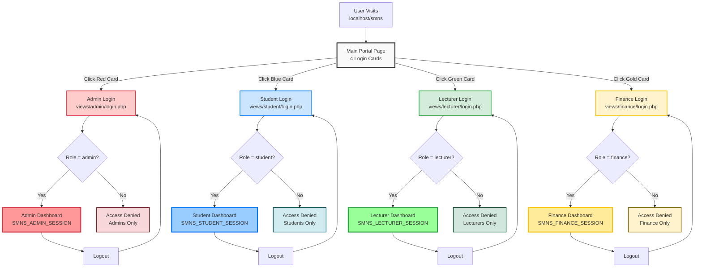

# Independent Login System Architecture

## Visual Flow Diagram



## Key Features

### 🎯 Independent Entry Points
Each role has its own dedicated login page with unique URL:
- **Admin:** Red card → `/views/admin/login.php`
- **Student:** Blue card → `/views/student/login.php`
- **Lecturer:** Green card → `/views/lecturer/login.php`
- **Finance:** Gold card → `/views/finance/login.php`

### 🔒 Role Validation
Each login validates the user's role:
- Admin login only accepts users with `role = 'admin'`
- Student login only accepts users with `role = 'student'`
- Lecturer login only accepts users with `role = 'lecturer'`
- Finance login only accepts users with `role = 'finance'`

**Wrong role = Access Denied!**

### 🎨 Color-Coded Design
- 🔴 **Admin:** Red (#dc3545) - Administrative authority
- 🔵 **Student:** Blue (#007bff) - Academic focus
- 🟢 **Lecturer:** Green (#28a745) - Educational growth
- 🟡 **Finance:** Gold (#ffc107) - Financial transactions

### 🔄 Smart Logout
Logout redirects back to the appropriate role-specific login page:
- Admin logs out → Returns to admin login
- Student logs out → Returns to student login
- Lecturer logs out → Returns to lecturer login
- Finance logs out → Returns to finance login

### 🛡️ Session Isolation
Each role uses a separate session namespace:
- `SMNS_ADMIN_SESSION`
- `SMNS_STUDENT_SESSION`
- `SMNS_LECTURER_SESSION`
- `SMNS_FINANCE_SESSION`

**Complete independence - no interference between roles!**

---

## User Journey Examples

### Example 1: Admin Login
```
1. Visit localhost/smns
2. See 4 colorful cards
3. Click RED "Administration" card
4. Redirected to /views/admin/login.php
5. Enter admin credentials
6. System validates: role === 'admin' ✓
7. Create SMNS_ADMIN_SESSION
8. Redirect to Admin Dashboard
9. Work as admin...
10. Click Logout
11. Redirected back to /views/admin/login.php
```

### Example 2: Student Trying Admin Login (Access Denied)
```
1. Visit /views/admin/login.php directly
2. Enter student credentials
3. System validates: role === 'student' ✗
4. Error: "Access denied. This login is for administrators only."
5. User remains on admin login page
6. No session created - authentication rejected
```

### Example 3: Multi-User Scenario
```
Browser 1: Admin logs in at /views/admin/login.php
          → SMNS_ADMIN_SESSION created ✓
          
Browser 2: Student logs in at /views/student/login.php
          → SMNS_STUDENT_SESSION created ✓
          
Browser 3: Lecturer logs in at /views/lecturer/login.php
          → SMNS_LECTURER_SESSION created ✓
          
Browser 4: Finance logs in at /views/finance/login.php
          → SMNS_FINANCE_SESSION created ✓

All 4 users work simultaneously - complete independence!
```

---

## Benefits Summary

✅ **Clear User Experience** - Users know exactly where to login
✅ **Enhanced Security** - Role validation at entry point
✅ **Complete Independence** - Each module has own login
✅ **Professional Design** - Color-coded and icon-based
✅ **Better Organization** - Logical separation by department
✅ **Flexible Bookmarks** - Users bookmark their specific login
✅ **Smart Redirects** - Logout returns to correct login page
✅ **Multi-User Support** - All roles can work simultaneously

---

**Seminary Results Management System**  
Independent Login System Architecture  
Date: February 12, 2026
