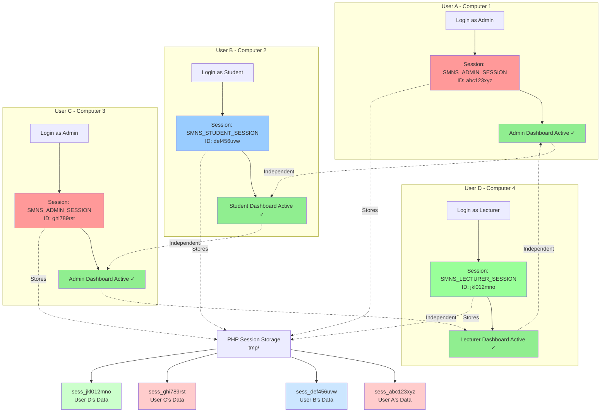

# Multi-User Concurrent Sessions - Visual Overview

## How Multiple Users Access the System Simultaneously



## Key Points Illustrated

### 1. Independent Session IDs
- **User A** (Admin): Session ID `abc123xyz`
- **User B** (Student): Session ID `def456uvw`
- **User C** (Admin): Session ID `ghi789rst` ← Same role, different session!
- **User D** (Lecturer): Session ID `jkl012mno`

Each user has a unique session ID stored in their browser cookie.

### 2. Separate Session Files on Server
The server stores each session in a separate file:
```
tmp/
├── sess_abc123xyz  (User A's admin session)
├── sess_def456uvw  (User B's student session)
├── sess_ghi789rst  (User C's admin session)
└── sess_jkl012mno  (User D's lecturer session)
```

### 3. Complete Independence
All users work simultaneously without any interference:
- User A logs in → Only creates/updates `sess_abc123xyz`
- User B logs in → Only creates/updates `sess_def456uvw`
- User C logs in → Only creates/updates `sess_ghi789rst`
- User D logs in → Only creates/updates `sess_jkl012mno`

**No user's login affects any other user's session!**

### 4. Role-Based Session Names
Session cookie names differ by role:
- 🔴 Admin → `SMNS_ADMIN_SESSION`
- 🔵 Student → `SMNS_STUDENT_SESSION`
- 🟢 Lecturer → `SMNS_LECTURER_SESSION`
- 🟠 Finance → `SMNS_FINANCE_SESSION`

But each cookie contains a **unique session ID** per user!

### 5. Same Role, Different Users
Notice User A and User C:
- Both are admins
- Both have `SMNS_ADMIN_SESSION` cookies
- But **different session ID values**:
  - User A: `abc123xyz`
  - User C: `ghi789rst`
- Completely independent sessions!

## Real-World Example

### Seminary Office Scenario
```
8:00 AM - r (Admin) logs in
         ↓
         Creates session: sess_reg123
         ↓
         Working... ✓

9:00 AM - Finance Officer logs in
         ↓
         Creates session: sess_fin456
         ↓
         Registrar still working... ✓
         Finance Officer working... ✓

10:00 AM - 50 Students log in for registration
          ↓
          Create 50 separate sessions:
          sess_std001, sess_std002, ..., sess_std050
          ↓
          r still working... ✓
          Finance Officer still working... ✓
          50 Students all working... ✓

11:00 AM - 5 Lecturers log in to enter marks
          ↓
          Create 5 more sessions:
          sess_lec01, sess_lec02, ..., sess_lec05
          ↓
          Everyone still working... ✓
```

**Result:** 57 concurrent users, all independent!

## What Makes This Work

### PHP Session Mechanism
1. **User sends request** with session cookie containing unique ID
2. **PHP reads the session ID** from the cookie
3. **PHP loads THAT user's session file** (sess_[sessionID])
4. **PHP works with THAT user's data** only
5. **PHP saves back to THAT user's session file** only

### Session ID is the Key
```
Request from User A:
Cookie: SMNS_ADMIN_SESSION=abc123xyz
         ↓
PHP loads: tmp/sess_abc123xyz
         ↓
Works with User A's data only
         ↓
Saves to: tmp/sess_abc123xyz
```

```
Request from User C:
Cookie: SMNS_ADMIN_SESSION=ghi789rst
         ↓
PHP loads: tmp/sess_ghi789rst
         ↓
Works with User C's data only
         ↓
Saves to: tmp/sess_ghi789rst
```

**Different session IDs = Different session files = Complete isolation!**

## Session Cookies in Browser

### User A's Browser
```
Application → Cookies → localhost
├── SMNS_ADMIN_SESSION
│   └── Value: abc123xyz
```

### User B's Browser
```
Application → Cookies → localhost
├── SMNS_STUDENT_SESSION
│   └── Value: def456uvw
```

### User C's Browser
```
Application → Cookies → localhost
├── SMNS_ADMIN_SESSION
│   └── Value: ghi789rst  ← Different from User A!
```

## Summary

✅ **Each user has a unique session ID**  
✅ **Each session ID maps to a separate file on the server**  
✅ **Session operations only affect the current user's file**  
✅ **Multiple users can be logged in simultaneously**  
✅ **Same role, different users = independent sessions**  
✅ **No interference between users**  
✅ **True multi-user concurrent access**

---

**Seminary Results Management System**  
Multi-User Concurrent Access Architecture  
Date: February 12, 2026
