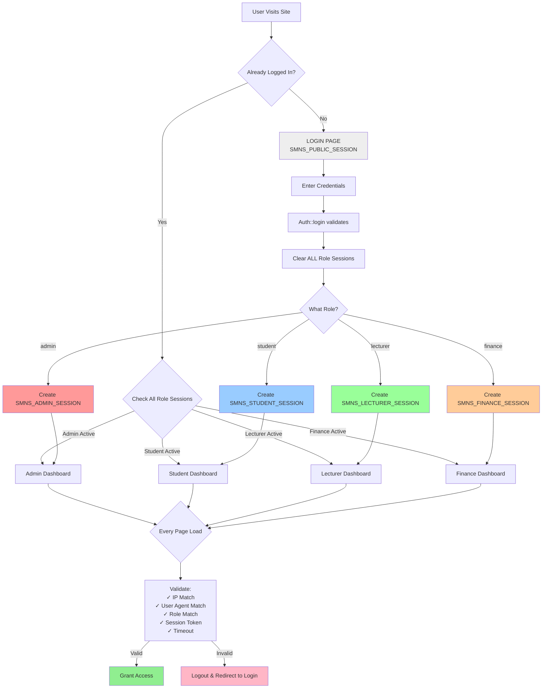

# Role-Based Session Isolation Architecture

## System Flow Diagram



## Architecture Overview

### Session Cookies by Role
- 🔴 **Admin**: `SMNS_ADMIN_SESSION` (Red)
- 🔵 **Student**: `SMNS_STUDENT_SESSION` (Blue)
- 🟢 **Lecturer**: `SMNS_LECTURER_SESSION` (Green)
- 🟠 **Finance**: `SMNS_FINANCE_SESSION` (Orange)
- ⚪ **Public**: `SMNS_PUBLIC_SESSION` (Gray)

### Key Security Features

1. **Complete Isolation**
   - Each role uses a separate PHP session
   - No shared session data between roles
   - Concurrent logins of different roles work independently

2. **Login Process**
   - User authenticates with credentials
   - System clears ALL role sessions
   - Creates fresh session for user's specific role
   - Redirects to role-appropriate dashboard

3. **Validation on Every Request**
   - IP address verification
   - User agent verification
   - Role match verification
   - Session token verification
   - Timeout check (1 hour)

4. **Access Control**
   - Valid validation → Page access granted
   - Invalid validation → Automatic logout and redirect to login
   - Cross-role access attempts → Redirect to user's actual dashboard

### Session Fingerprint Components

```
SHA-256 Hash = hash(
    User Agent +
    IP Address +
    Role +
    Session ID
)
```

### Security Benefits

✅ **Session Hijacking Prevention** - IP and user agent must match
✅ **Session Fixation Prevention** - Session ID regenerated on login
✅ **Cross-Role Interference Prevention** - Separate session spaces
✅ **Privilege Escalation Prevention** - Role validated on every request
✅ **Session Tampering Detection** - Session role must match user role
✅ **Concurrent Login Support** - Different roles use different sessions

---

**Seminary Results Management System**  
*Enterprise-Grade Session Management*  
Date: February 12, 2026
