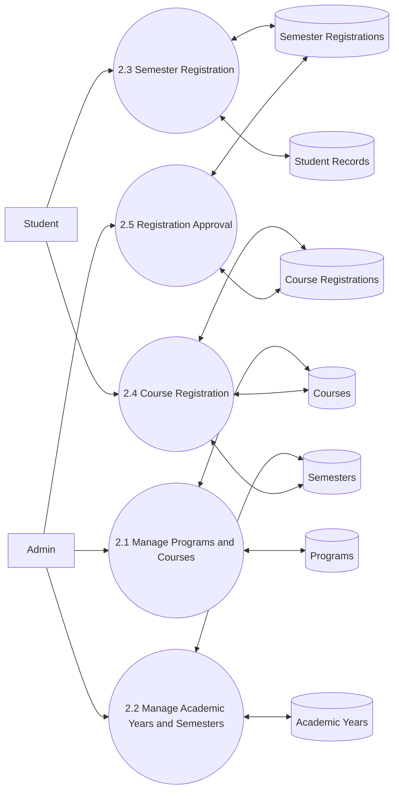
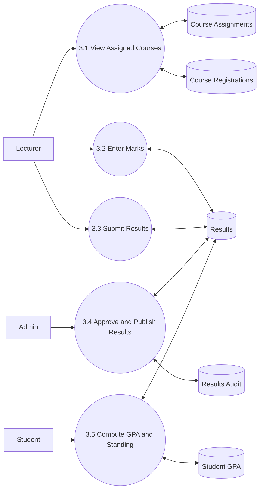
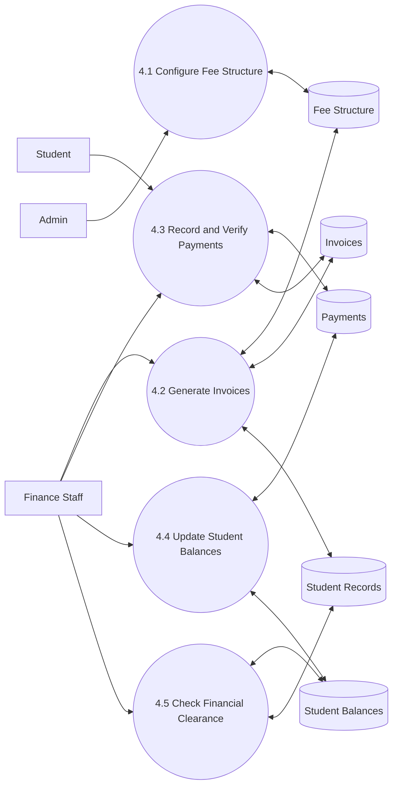
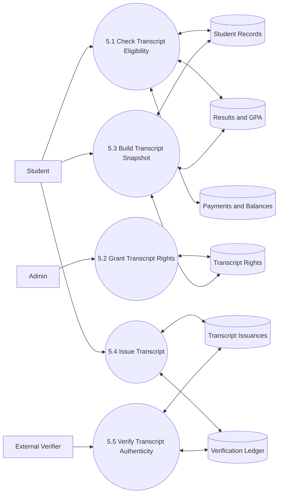

# SMNS DFD Level 2 Diagram

This document gives a report-ready `Level 2 Data Flow Diagram` for the Seminary Management and Results System (`SMNS`).

It expands the major `Level 1` subprocesses into detailed internal processes based on the current SMNS modules in this repository.

## Combined Level 2 Overview

```mermaid
flowchart LR
    student[Student]
    lecturer[Lecturer]
    admin[Admin]
    finance[Finance Staff]
    verifier[External Verifier]

    subgraph academic[2.0 Academic and Registration Management]
        p21((2.1 Manage Programs and Courses))
        p22((2.2 Manage Academic Years and Semesters))
        p23((2.3 Semester Registration))
        p24((2.4 Course Registration))
        p25((2.5 Registration Approval))
    end

    subgraph results[3.0 Results Management]
        p31((3.1 View Assigned Courses))
        p32((3.2 Enter Marks))
        p33((3.3 Submit Results))
        p34((3.4 Approve and Publish Results))
        p35((3.5 Compute GPA and Standing))
    end

    subgraph billing[4.0 Finance and Billing Management]
        p41((4.1 Configure Fee Structure))
        p42((4.2 Generate Invoices))
        p43((4.3 Record and Verify Payments))
        p44((4.4 Update Student Balances))
        p45((4.5 Check Financial Clearance))
    end

    subgraph transcript[5.0 Transcript and Verification Management]
        p51((5.1 Check Transcript Eligibility))
        p52((5.2 Grant Transcript Rights))
        p53((5.3 Build Transcript Snapshot))
        p54((5.4 Issue Transcript))
        p55((5.5 Verify Transcript Authenticity))
    end

    d1[(Programs and Courses)]
    d2[(Academic Years and Semesters)]
    d3[(Student Records)]
    d4[(Semester and Course Registrations)]
    d5[(Course Assignments)]
    d6[(Results and GPA)]
    d7[(Results Audit)]
    d8[(Fee Structures)]
    d9[(Invoices, Payments and Balances)]
    d10[(Transcript Rights, Issuances and Verification Ledger)]

    admin --> p21
    admin --> p22
    student --> p23
    student --> p24
    admin --> p25

    lecturer --> p31
    lecturer --> p32
    lecturer --> p33
    admin --> p34
    student --> p35

    admin --> p41
    finance --> p42
    finance --> p43
    student --> p43
    finance --> p44
    finance --> p45

    student --> p51
    admin --> p52
    student --> p53
    student --> p54
    verifier --> p55

    p21 <--> d1
    p22 <--> d2
    p23 <--> d3
    p23 <--> d4
    p24 <--> d1
    p24 <--> d2
    p24 <--> d4
    p25 <--> d4

    p31 <--> d5
    p31 <--> d4
    p32 <--> d6
    p33 <--> d6
    p34 <--> d6
    p34 <--> d7
    p35 <--> d6

    p41 <--> d8
    p42 <--> d8
    p42 <--> d3
    p42 <--> d9
    p43 <--> d9
    p44 <--> d9
    p45 <--> d3
    p45 <--> d9

    p51 <--> d3
    p51 <--> d6
    p51 <--> d9
    p52 <--> d10
    p53 <--> d3
    p53 <--> d6
    p53 <--> d10
    p54 <--> d10
    p55 <--> d10
```

## Level 2: Academic and Registration Management

## Level 2: Results Management

## Level 2: Finance and Billing Management

## Level 2: Transcript and Verification Management

## Recommended Use

- Use the `Combined Level 2 Overview` when you want one complete Level 2 DFD for presentation.
- Use the separate diagrams when your report expects one Level 2 expansion per major Level 1 process.
- If you want a visual image version next, this content can be converted into `draw.io` or exported as PNG.
