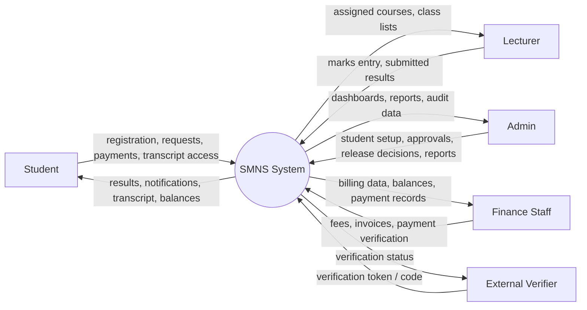
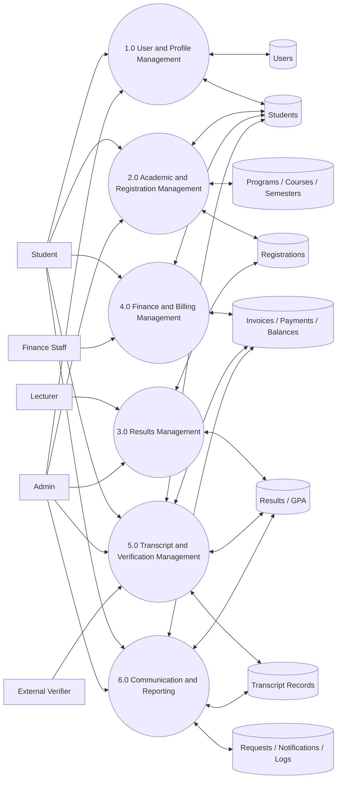
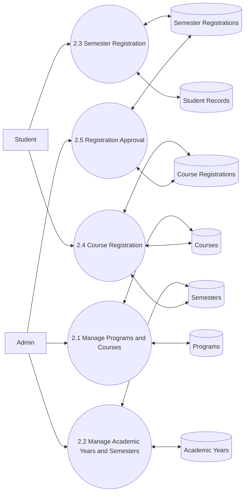
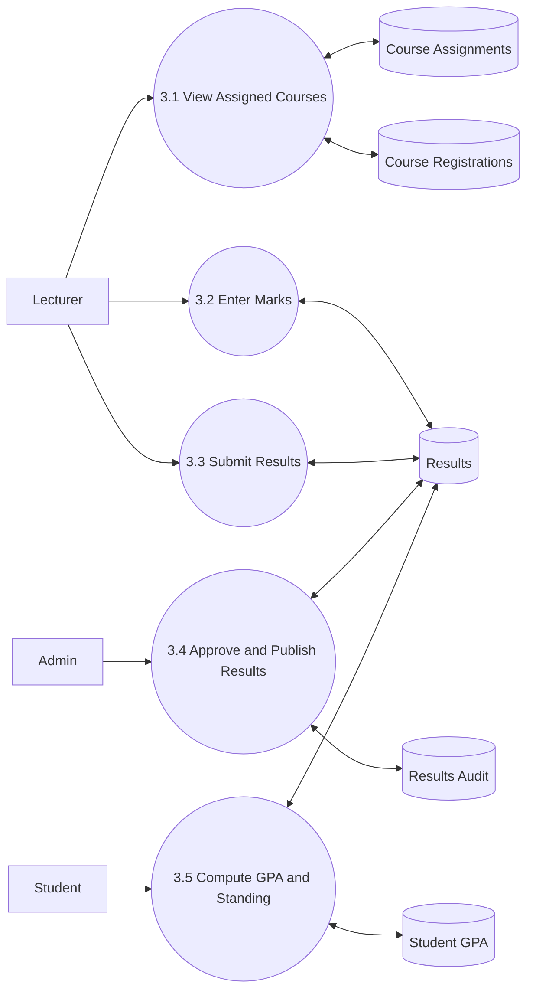
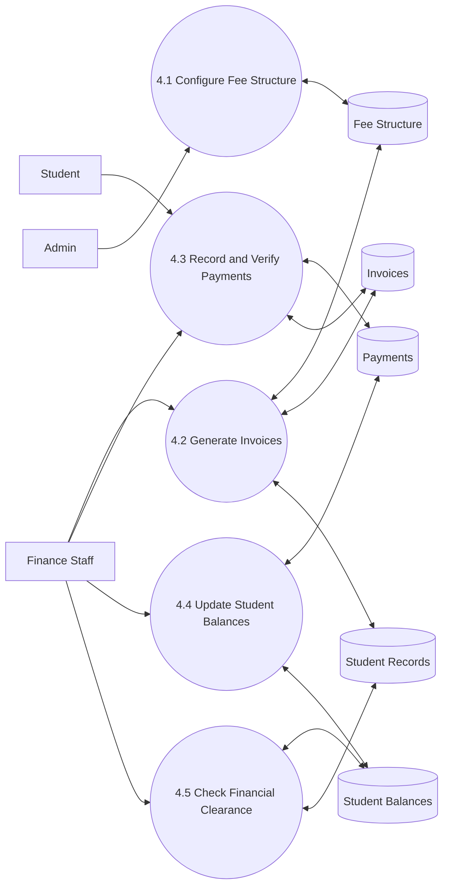
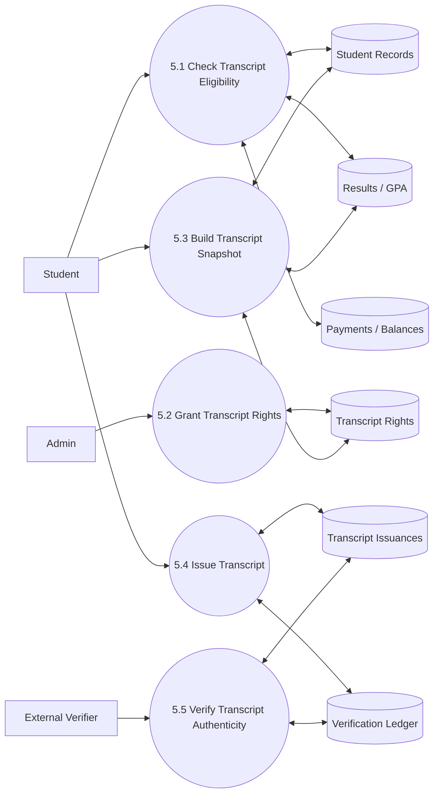

# SMNS Data Flow Diagrams

This document presents the Seminary Management and Results System (`SMNS`) using the standard DFD levels used in academic reports.

Use this structure in your report:

1. `Level 0` – Context Diagram
2. `Level 1` – Main subprocesses
3. `Level 2` – Detailed breakdown of major processes

## Level 0: Context Diagram

This level shows the whole system as one process and the external entities that interact with it.

## Level 1: Main System Breakdown

This level breaks SMNS into its main functional subprocesses.

## Level 2: Academic and Registration Management

This level expands process `2.0 Academic and Registration Management`.

## Level 2: Results Management

This level expands process `3.0 Results Management`.

## Level 2: Finance and Billing Management

This level expands process `4.0 Finance and Billing Management`.

## Level 2: Transcript and Verification Management

This level expands process `5.0 Transcript and Verification Management`.

## Recommended Report Usage

- Use `Level 0` in the system overview section.
- Use `Level 1` in the analysis or design chapter.
- Use the `Level 2` diagrams in the detailed system design section.

## Recommended Order In Your Report

1. Context Diagram (`Level 0`)
2. DFD Level 1
3. DFD Level 2 for Academic and Registration
4. DFD Level 2 for Results
5. DFD Level 2 for Finance
6. DFD Level 2 for Transcript and Verification
