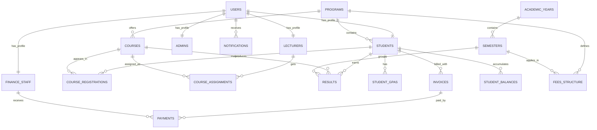
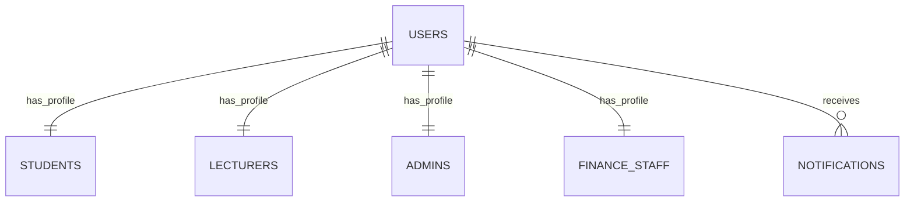
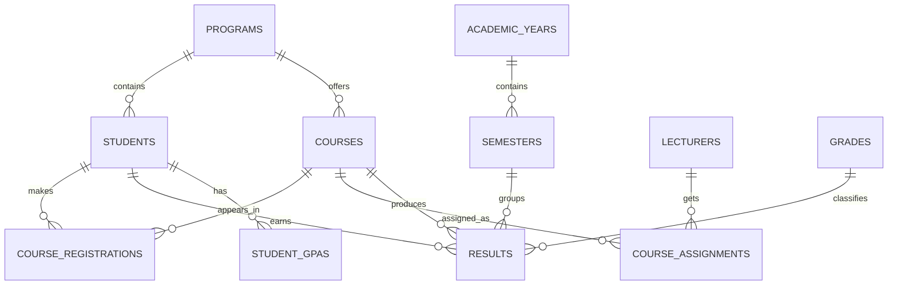
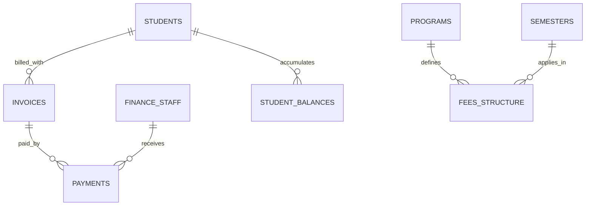

# SMNS Basic ERD and Relationship Explanation

This document reproduces the current Seminary Management and Results System (`SMNS`) entity relationships in a simpler academic format and explains what each arrow means.

## How To Read The Arrows

- `1:1` means one record in table A matches one record in table B.
- `1:M` means one record in table A can match many records in table B.
- The arrow normally points from the parent table to the child table.
- The child table usually contains the foreign key (`FK`).

Example:

- `users 1:M notifications` means one user can have many notifications.
- `users 1:1 students` means one user account belongs to one student profile.

## Basic ERD

## Main Tables In Simple Groups

### 1. Core and User Tables

- `users`
- `students`
- `lecturers`
- `admins`
- `finance_staff`
- `notifications`

### 2. Academic Tables

- `programs`
- `courses`
- `academic_years`
- `semesters`
- `course_registrations`
- `course_assignments`
- `results`
- `student_gpas`
- `grades`

### 3. Finance Tables

- `fees_structure`
- `invoices`
- `payments`
- `student_balances`

## Arrow-By-Arrow Explanation

### 1. `users 1:1 students`

- Meaning: one user account belongs to one student profile.
- Foreign key: `students.user_id -> users.id`
- Explanation: the `users` table stores login and system access details, while `students` stores student biodata and academic identity.

### 2. `users 1:1 lecturers`

- Meaning: one user account belongs to one lecturer profile.
- Foreign key: `lecturers.user_id -> users.id`
- Explanation: lecturer login details are kept in `users`, while lecturer-specific details are kept in `lecturers`.

### 3. `users 1:1 admins`

- Meaning: one user account belongs to one admin profile.
- Foreign key: `admins.user_id -> users.id`
- Explanation: this separates system authentication data from administrative profile data.

### 4. `users 1:1 finance_staff`

- Meaning: one user account belongs to one finance staff profile.
- Foreign key: `finance_staff.user_id -> users.id`
- Explanation: finance officers log in through `users` but their staff details are stored separately.

### 5. `programs 1:M students`

- Meaning: one program can have many students.
- Foreign key: `students.program_id -> programs.id`
- Explanation: many students may belong to the same academic program.

### 6. `programs 1:M courses`

- Meaning: one program can have many courses.
- Foreign key: `courses.program_id -> programs.id`
- Explanation: courses are grouped under academic programs.

### 7. `academic_years 1:M semesters`

- Meaning: one academic year can contain many semesters.
- Foreign key: `semesters.academic_year_id -> academic_years.id`
- Explanation: semesters are subdivisions of an academic year.

### 8. `students 1:M course_registrations`

- Meaning: one student can register for many courses.
- Foreign key: `course_registrations.student_id -> students.id`
- Explanation: each registration row represents one student enrolling in one course in a semester.

### 9. `courses 1:M course_registrations`

- Meaning: one course can appear in many student registrations.
- Foreign key: `course_registrations.course_id -> courses.id`
- Explanation: many students can register for the same course.

### 10. `lecturers 1:M course_assignments`

- Meaning: one lecturer can be assigned many course assignment records.
- Foreign key: `course_assignments.lecturer_id -> lecturers.id`
- Explanation: a lecturer may teach multiple courses.

### 11. `courses 1:M course_assignments`

- Meaning: one course can have many assignment records.
- Foreign key: `course_assignments.course_id -> courses.id`
- Explanation: a course may be assigned to lecturers across semesters or teaching periods.

### 12. `students 1:M results`

- Meaning: one student can have many result records.
- Foreign key: `results.student_id -> students.id`
- Explanation: each student receives results for different courses and semesters.

### 13. `courses 1:M results`

- Meaning: one course can produce many result records.
- Foreign key: `results.course_id -> courses.id`
- Explanation: each course has results for many students.

### 14. `semesters 1:M results`

- Meaning: one semester can contain many results.
- Foreign key: `results.semester_id -> semesters.id`
- Explanation: result entries are organized by semester.

### 15. `students 1:M student_gpas`

- Meaning: one student can have many GPA records.
- Foreign key: `student_gpas.student_id -> students.id`
- Explanation: a student may have one GPA entry per semester or reporting period.

### 16. `students 1:M invoices`

- Meaning: one student can have many invoices.
- Foreign key: `invoices.student_id -> students.id`
- Explanation: a student may be billed multiple times across semesters.

### 17. `students 1:M fees_structure`

- Meaning in the current diagram: one student is related to many fee structure rows.
- Direct FK shown in table: none from `fees_structure` to `students`
- Actual practical meaning: fee structure is usually determined by the student's `program`, `level_year`, and `semester`, not by a direct student foreign key.
- Safer explanation: this is better understood as a business rule relationship, not a strict direct database relationship.

### 18. `invoices 1:M payments`

- Meaning: one invoice can have many payments.
- Foreign key: `payments.invoice_id -> invoices.id`
- Explanation: a student may clear one invoice using one payment or several partial payments.

### 19. `finance_staff 1:M payments`

- Meaning: one finance staff member can receive many payments.
- Foreign key: `payments.received_by -> finance_staff.id`
- Explanation: each payment may be recorded by a particular finance officer.

### 20. `students 1:M student_balances`

- Meaning: one student can have many balance records.
- Foreign key: `student_balances.student_id -> students.id`
- Explanation: balances are often tracked by semester or billing period.

### 21. `users 1:M notifications`

- Meaning: one user can receive many notifications.
- Foreign key: `notifications.user_id -> users.id`
- Explanation: the system can send multiple alerts, reminders, or updates to the same user.

## Notes About `grades`

The `grades` table appears in the visual diagram, but no arrow is drawn to `results` in the current `erd.drawio`.

In practice, it usually works like this:

- `grades` defines grading ranges and points.
- `results` uses those rules to determine `grade` and `grade_points`.

So academically, you may describe it as:

This is a logical relationship even if the current file does not show it as a direct foreign key.

## Cleaner Report Version

If you want a cleaner report diagram, you can present the relationships in three smaller ERDs:

### User Management ERD

### Academic ERD

### Finance ERD

## Recommended Wording For Your Report

You can explain the arrows in your report like this:

- A `1:1` relationship means each record in one table matches exactly one record in another table.
- A `1:M` relationship means one parent record can be associated with many child records.
- Foreign keys are used to enforce these relationships in the database.
- Some links may be conceptual, meaning they describe business logic even when no direct foreign key exists.

