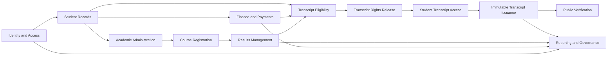
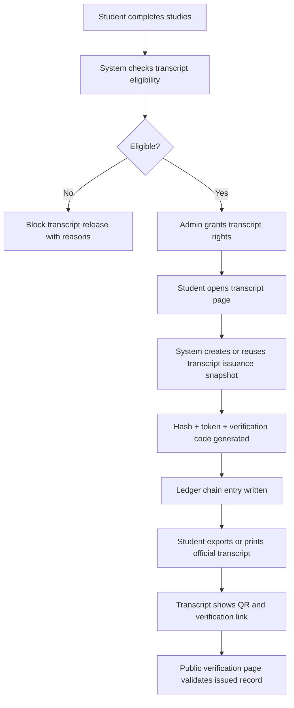

# Stakeholder System Overview

## Purpose

The Seminary Management and Results System (`SMNS`) is a multi-role academic administration platform for managing the full student lifecycle from admission and enrollment to payment tracking, results publishing, transcript release, and verifiable transcript issuance.

This document is intended for stakeholders who need a fast, high-level understanding of:

- what the system does today
- how the modules connect
- how a student moves through the platform
- how transcript release and verification now work

## Core Roles

The current system is built around four main operational roles:

- `Admin`: governance, student management, academic setup, approvals, transcript rights, reporting, and system control
- `Lecturer`: teaching allocation, course lists, result entry, and submission
- `Finance`: fee structures, invoices, payment verification, PRN/payment workflows
- `Student`: registration, payments, results, transcript access, requests, and notifications

## System Modules

### 1. Identity and Access

- Login and role-based access control
- Password reset and MFA scaffolding
- Session control and security enforcement

### 2. Student Records

- Student bio-data
- academic status
- graduation and awards profile
- discipline and eligibility information

### 3. Academic Administration

- academic years and semesters
- programs and courses
- semester registration approval
- course registration tracking

### 4. Results Management

- lecturer result entry
- result review/submission
- published results
- GPA/CGPA computation

### 5. Finance and Payments

- fee structures
- PRN generation
- mobile money and bank payment workflows
- payment verification and ledger posting

### 6. Student Services

- service requests
- notifications and communications
- transcript request and release workflow

### 7. Reporting and Governance

- reports and schedules
- backup and restore processes
- uptime and system health monitoring
- audit and operational logs

### 8. Transcript Verification

- transcript eligibility checks
- admin-controlled transcript release
- one-time export control
- immutable issued transcript records
- public token-based verification

## Module Relationship Diagram

## End-to-End Student Lifecycle

The system currently supports the following operating flow.

### Phase 1: Admission and Account Setup

1. Admin creates or approves a student record.
2. Student receives a role-linked account.
3. Student completes or updates bio-data.

### Phase 2: Academic Structuring

1. Admin configures programs, academic years, semesters, and courses.
2. Student proceeds into semester registration and course registration.
3. Admin verifies and approves registrations where required.

### Phase 3: Learning and Assessment

1. Lecturers access assigned course lists.
2. Lecturers enter and submit results.
3. Results move from draft/submitted state to published state.
4. Student views published results and GPA progression.

### Phase 4: Financial Clearance

1. Finance configures fees and invoices.
2. Student generates PRN or other payment reference.
3. Student pays through supported channels.
4. Finance/payment workflows verify and post payments.
5. Outstanding balances affect transcript eligibility.

### Phase 5: Graduation and Eligibility

1. Student academic status reaches completion/graduation stage.
2. System evaluates transcript eligibility:
   - completed studies
   - no outstanding retakes
   - bills cleared
   - discipline in good standing
3. Admin reviews graduation/transcript readiness.

### Phase 6: Transcript Release

1. Admin grants transcript rights.
2. Student gains transcript viewing access.
3. Student can use one-time official export where enabled.

### Phase 7: Transcript Issuance and Verification

1. System creates a canonical transcript snapshot.
2. The snapshot is hashed.
3. A verification code and token are generated.
4. The issuance is stored in `transcript_issuances`.
5. A chained ledger entry is written in `transcript_issuance_ledger`.
6. The student-facing transcript displays:
   - verification code
   - transcript hash
   - verification token
   - verification link
   - QR code
7. Public users verify authenticity through the token-based verification page.

## Transcript Release and Verification Flow

## What Makes the Current Transcript Feature Unique

The present transcript implementation is stronger than a normal downloadable transcript because it includes:

- admin-controlled release, not automatic unrestricted download
- eligibility enforcement tied to academic, financial, and discipline status
- one-time official export control
- immutable transcript issuance snapshot storage
- append-only ledger-style verification trail
- token-based public verification
- QR-supported verification on the student transcript itself

This makes the transcript feature suitable for:

- official student self-service transcript sharing
- verification by third parties without calling the institution
- historical preservation of issued transcript versions

## Current Transcript Data Model Summary

### `transcript_download_rights`

Controls whether a student is allowed to access and export an official transcript.

### `transcript_issuances`

Stores the exact issued transcript snapshot with:

- student reference
- transcript hash
- verification code
- verification token
- issue time
- export format
- active/revoked status

### `transcript_issuance_ledger`

Stores append-only chain entries so issuance and revocation actions become tamper-evident.

## Operational Flow by Role

### Admin

- sets up the academic structure
- manages students and graduation state
- approves transcript rights
- monitors issued transcripts
- can revoke issued transcript records when necessary

### Lecturer

- enters and submits results
- directly affects GPA and transcript data completeness

### Finance

- clears payment obligations
- affects transcript eligibility through financial clearance

### Student

- maintains bio-data
- registers and studies
- checks payments and results
- accesses transcript after release
- shares the official transcript using the embedded verification artifact

## Practical Stakeholder Talking Points

When presenting the system, the most useful talking points are:

1. `End-to-end coverage`: the system covers student administration, academics, finance, results, and transcript release in one platform.
2. `Control`: transcript access is not merely downloadable; it is governed by institutional rules and approval.
3. `Integrity`: the transcript is issued as a preserved snapshot, not just a live page.
4. `Verification`: third parties can verify an issued transcript through a token/QR flow.
5. `Auditability`: issuance and revocation are tracked and manageable from the admin side.
6. `Historical retention`: issued transcript versions remain historically stored for future reference.

## Suggested Demonstration Sequence

For a live stakeholder presentation, demonstrate in this order:

1. Admin dashboard and role-based structure
2. Student management and graduation profile
3. Lecturer result entry or published results example
4. Finance/payment clearance example
5. Transcript eligibility checklist
6. Admin transcript rights release
7. Student transcript view
8. QR/verification code block on transcript
9. Public verification page
10. Admin issued transcripts page

## Key Pages for Demonstration

- Student transcript: `/views/student/transcript.php`
- Public verification: `/views/verify/transcript.php`
- Admin graduation and transcript release: `/views/admin/students/graduation-awards.php`
- Admin student transcript rights: `/views/admin/students/view.php`
- Admin issued transcript management: `/views/admin/students/issued-transcripts.php`
- Admin transcript requests: `/views/admin/student_requests.php?view=transcript`
- System health and uptime: `/views/admin/system/health.php`

## Current Position

As the system stands now, it is no longer only a results portal. It is an integrated academic operations platform with a controlled and verifiable transcript release process.

That transcript process is currently one of the system's strongest differentiators for stakeholder presentation.
