# SMNS Concept Diagram

A concept diagram is very useful for the SMNS system.

It is best when you want to show:

- the main ideas behind the system
- the major modules at a glance
- how the parts of the system are related conceptually

It is simpler than:

- `DFD`, which focuses on data movement
- `ERD`, which focuses on database tables
- `Flowchart`, which focuses on process steps

## Why It Fits SMNS

For SMNS, a concept diagram is good for:

- report introduction
- system overview chapter
- proposal or presentation slides
- viva explanation

## SMNS Concept Diagram

```mermaid
flowchart TD
    A[SMNS<br/>Seminary Management and Results System]

    A --> B[User Management]
    A --> C[Student Management]
    A --> D[Academic Management]
    A --> E[Results Management]
    A --> F[Finance Management]
    A --> G[Transcript Management]
    A --> H[Communication and Requests]
    A --> I[Reporting and Audit]

    B --> B1[Authentication]
    B --> B2[Roles and Permissions]
    B --> B3[Account Security]

    C --> C1[Student Profiles]
    C --> C2[Registration Numbers]
    C --> C3[Guardian and Bio-data]

    D --> D1[Programs]
    D --> D2[Courses]
    D --> D3[Academic Years and Semesters]
    D --> D4[Course Registration]

    E --> E1[Marks Entry]
    E --> E2[Approval and Publishing]
    E --> E3[GPA and Academic Standing]

    F --> F1[Fee Structure]
    F --> F2[Invoices]
    F --> F3[Payments]
    F --> F4[Balances]

    G --> G1[Eligibility Check]
    G --> G2[Transcript Release]
    G --> G3[Verification Code and QR]

    H --> H1[Notifications]
    H --> H2[Student Requests]
    H --> H3[Announcements]

    I --> I1[Reports]
    I --> I2[Activity Logs]
    I --> I3[Results Audit]
```

## Best Place To Use It

- Put the concept diagram at the beginning of the system design chapter.
- Use it before the `DFD`, `ERD`, and `Flowchart`.
- It helps the reader understand the whole system first.

## Recommended Order In Your Report

1. Concept Diagram
2. DFD
3. Flowchart
4. ERD

This order moves from general to detailed.
