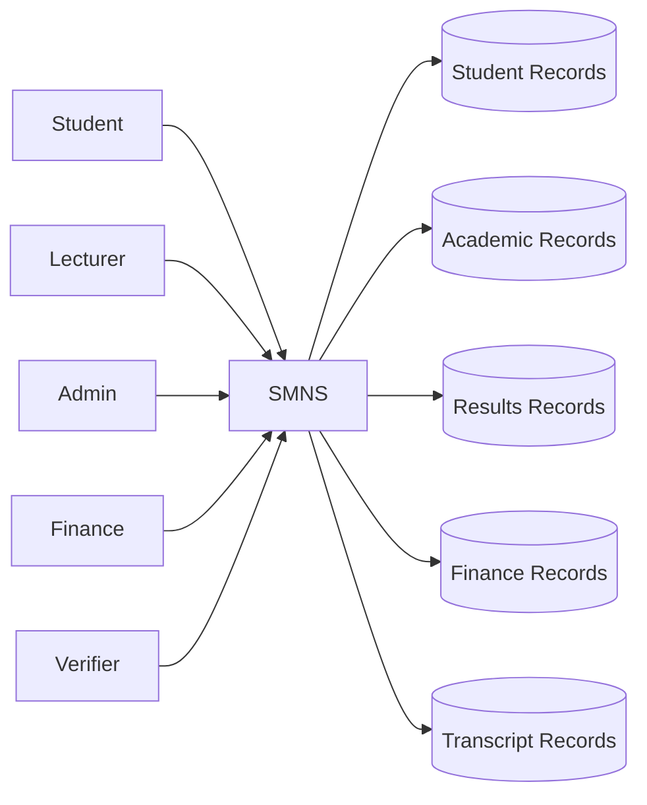
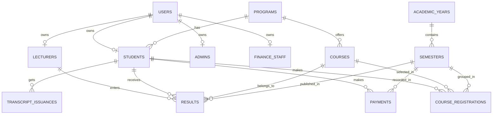
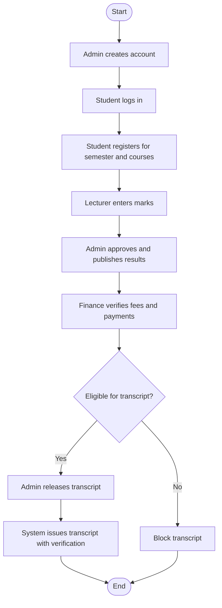

# SMNS Simple Report Diagrams

This is a simplified exam and report version of the SMNS diagrams.

Use these when you need:

- fewer entities on one page
- easier explanation during viva or presentation
- cleaner report screenshots

## Simple DFD

## Simple ERD

## Simple Flowchart

## Recommended Report Usage

- Use this file in the main report body.
- Use the full version in [System-Diagrams.md](/r:/xxxamp/htdocs/smns/docs/System-Diagrams.md) as appendix or technical reference.
