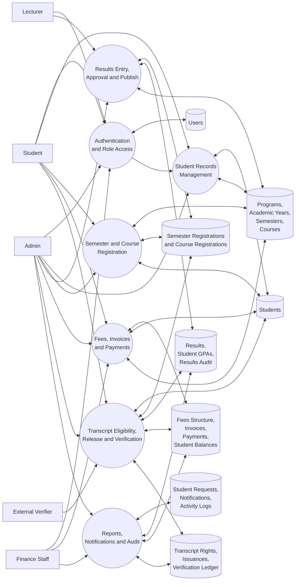
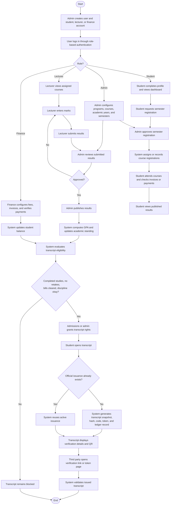

# SMNS System Diagrams

This document provides presentation-ready diagrams for the Seminary Management and Results System (`SMNS`) based on the current codebase and database structure.

It includes:

- a `DFD` for showing how information moves through the system
- an `ERD` for showing the main data model
- a `Flowchart` for showing the end-to-end operational process

## 1. Data Flow Diagram

This `DFD` is the best high-level diagram for describing how the SMNS system works to non-technical stakeholders.

## 2. Entity Relationship Diagram

This `ERD` focuses on the main academic, user, finance, and transcript entities that describe the current SMNS data model.

```mermaid
erDiagram
    USERS {
        int id PK
        string username
        string email
        string role
        string status
    }

    ADMINS {
        int id PK
        int user_id FK
        string first_name
        string last_name
    }

    LECTURERS {
        int id PK
        int user_id FK
        string first_name
        string last_name
        string department
        string status
    }

    FINANCE_STAFF {
        int id PK
        int user_id FK
        string first_name
        string last_name
        string status
    }

    PROGRAMS {
        int id PK
        string program_code
        string program_name
        int duration_years
        string status
    }

    ACADEMIC_YEARS {
        int id PK
        string year_name
        string status
    }

    SEMESTERS {
        int id PK
        int academic_year_id FK
        string semester_name
        int semester_number
        string status
    }

    STUDENTS {
        int id PK
        int user_id FK
        string student_id
        string admission_number
        int program_id FK
        int current_semester FK
        int entry_semester_id FK
        string academic_status
        string status
    }

    COURSES {
        int id PK
        string course_code
        string course_name
        int program_id FK
        int level_year
        int semester_offered
        decimal credit_hours
        string status
    }

    COURSE_ASSIGNMENTS {
        int id PK
        int lecturer_id FK
        int course_id FK
        int semester_id FK
        string status
    }

    SEMESTER_REGISTRATIONS {
        int id PK
        int student_id FK
        int semester_id FK
        int year_of_study
        string status
    }

    COURSE_REGISTRATIONS {
        int id PK
        int student_id FK
        int course_id FK
        int semester_id FK
        string status
    }

    RESULTS {
        int id PK
        int student_id FK
        int course_id FK
        int semester_id FK
        int entered_by FK
        int approved_by FK
        decimal total_marks
        string grade
        decimal grade_points
        string status
    }

    RESULTS_AUDIT {
        int id PK
        int result_id FK
        int student_id FK
        int course_id FK
        int changed_by_user_id FK
        string change_type
    }

    STUDENT_GPAS {
        int id PK
        int student_id FK
        int semester_id FK
        decimal semester_gpa
        decimal cumulative_gpa
    }

    FEES_STRUCTURE {
        int id PK
        int program_id FK
        int academic_year_id FK
        string fee_type
        decimal amount
        string status
    }

    INVOICES {
        int id PK
        int student_id FK
        int semester_id FK
        decimal total_amount
        string status
    }

    PAYMENTS {
        int id PK
        int student_id FK
        int semester_id FK
        decimal amount_paid
        string payment_method
        string payment_status
    }

    STUDENT_BALANCES {
        int id PK
        int student_id FK
        int semester_id FK
        decimal total_fees
        decimal total_paid
        decimal balance
    }

    STUDENT_REQUESTS {
        int id PK
        int student_id FK
        int user_id FK
        int semester_id FK
        string request_type
        string status
    }

    TRANSCRIPT_DOWNLOAD_RIGHTS {
        int id PK
        int student_id FK
        string status
        int verified_by_user_id FK
    }

    TRANSCRIPT_ISSUANCES {
        int id PK
        int student_id FK
        string transcript_hash
        string verification_code
        string verification_token
        string status
    }

    TRANSCRIPT_ISSUANCE_LEDGER {
        int id PK
        int issuance_id FK
        string action_type
        string current_hash
    }

    NOTIFICATIONS {
        int id PK
        int user_id FK
        string title
        string type
    }

    ACTIVITY_LOGS {
        int id PK
        int user_id FK
        string action
        string module
    }

    USERS ||--o| ADMINS : owns_profile
    USERS ||--o| LECTURERS : owns_profile
    USERS ||--o| FINANCE_STAFF : owns_profile
    USERS ||--o| STUDENTS : owns_profile

    PROGRAMS ||--o{ STUDENTS : admits
    PROGRAMS ||--o{ COURSES : offers
    PROGRAMS ||--o{ FEES_STRUCTURE : defines

    ACADEMIC_YEARS ||--o{ SEMESTERS : contains
    ACADEMIC_YEARS ||--o{ FEES_STRUCTURE : applies_to

    SEMESTERS ||--o{ COURSE_ASSIGNMENTS : schedules
    SEMESTERS ||--o{ SEMESTER_REGISTRATIONS : registers
    SEMESTERS ||--o{ COURSE_REGISTRATIONS : groups
    SEMESTERS ||--o{ RESULTS : publishes_in
    SEMESTERS ||--o{ STUDENT_GPAS : calculates_for
    SEMESTERS ||--o{ INVOICES : bills_for
    SEMESTERS ||--o{ PAYMENTS : records_for
    SEMESTERS ||--o{ STUDENT_BALANCES : tracks
    SEMESTERS ||--o{ STUDENT_REQUESTS : relates_to

    LECTURERS ||--o{ COURSE_ASSIGNMENTS : teaches
    COURSES ||--o{ COURSE_ASSIGNMENTS : assigned

    STUDENTS ||--o{ SEMESTER_REGISTRATIONS : submits
    STUDENTS ||--o{ COURSE_REGISTRATIONS : enrolls
    COURSES ||--o{ COURSE_REGISTRATIONS : selected

    STUDENTS ||--o{ RESULTS : receives
    COURSES ||--o{ RESULTS : assessed_in
    LECTURERS ||--o{ RESULTS : enters
    ADMINS ||--o{ RESULTS : approves

    RESULTS ||--o{ RESULTS_AUDIT : audited_by
    STUDENTS ||--o{ RESULTS_AUDIT : traced_for
    COURSES ||--o{ RESULTS_AUDIT : traced_for
    USERS ||--o{ RESULTS_AUDIT : changes

    STUDENTS ||--o{ STUDENT_GPAS : accumulates

    STUDENTS ||--o{ INVOICES : billed
    STUDENTS ||--o{ PAYMENTS : pays
    STUDENTS ||--o{ STUDENT_BALANCES : owes

    STUDENTS ||--o{ STUDENT_REQUESTS : raises
    USERS ||--o{ STUDENT_REQUESTS : authenticates

    STUDENTS ||--o| TRANSCRIPT_DOWNLOAD_RIGHTS : granted_right
    USERS ||--o{ TRANSCRIPT_DOWNLOAD_RIGHTS : verifies
    STUDENTS ||--o{ TRANSCRIPT_ISSUANCES : issued
    TRANSCRIPT_ISSUANCES ||--o{ TRANSCRIPT_ISSUANCE_LEDGER : chained_into

    USERS ||--o{ NOTIFICATIONS : receives
    USERS ||--o{ ACTIVITY_LOGS : performs
```

## 3. System Flowchart

This flowchart shows the main operational path from account creation to transcript verification.

## Recommended Use In Your Report

- Use the `DFD` in the chapter that explains how the whole system works.
- Use the `ERD` in the database design chapter.
- Use the `Flowchart` in the system process or methodology chapter.

## Notes

- The diagrams are based on the current SMNS codebase and database backup files in this repository.
- The `ERD` is intentionally focused on the main operational entities so it stays readable for academic documentation.
- If you want, these diagrams can also be converted into `draw.io`, `PlantUML`, or image files later.
