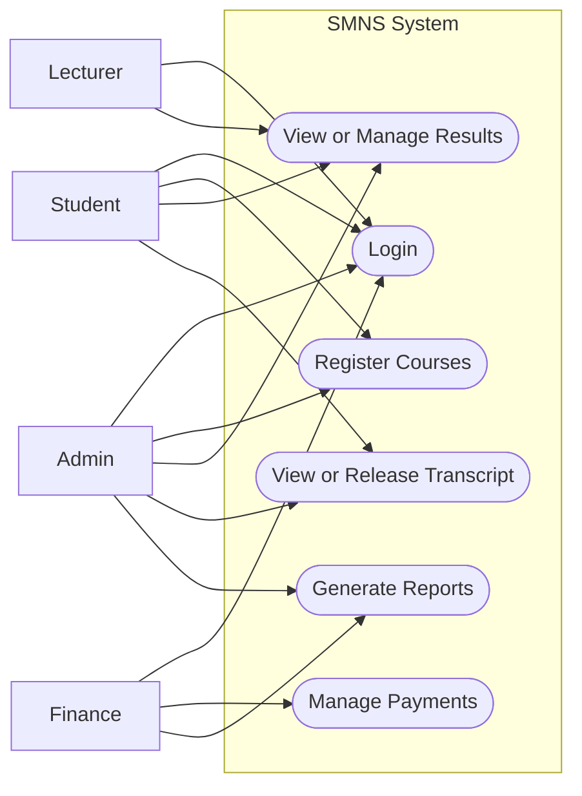
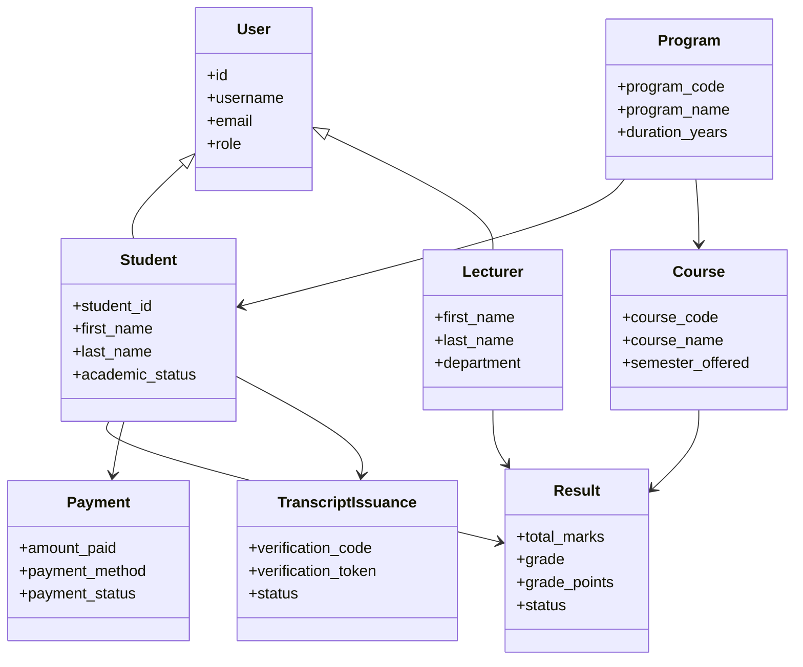
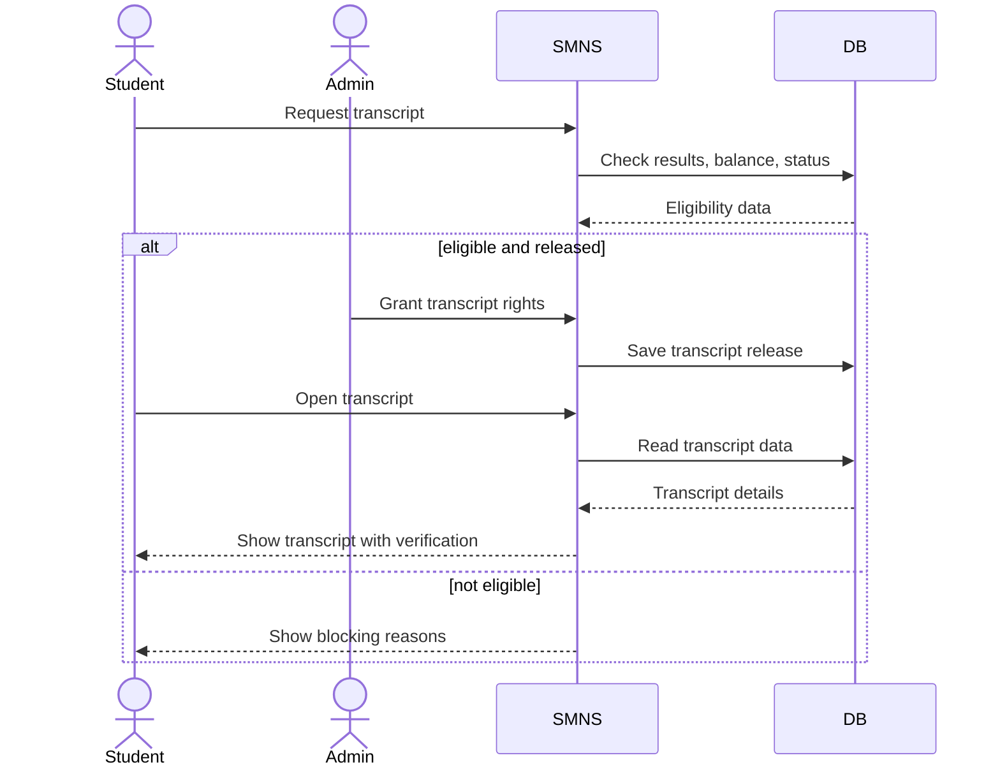

# SMNS Simple UML Diagrams

This file contains simpler exam-style UML diagrams for the Seminary Management and Results System (`SMNS`).

These are easier to explain in:

- report writing
- presentations
- viva defense
- printed documentation

## 1. Simple Use Case Diagram

## 2. Simple Class Diagram

## 3. Simple Sequence Diagram

## Recommended Use

- Use these simpler diagrams in the main report body.
- Use the fuller UML diagrams in [UML-System-Design.md](/r:/xxxamp/htdocs/smns/docs/UML-System-Design.md) as technical support.
