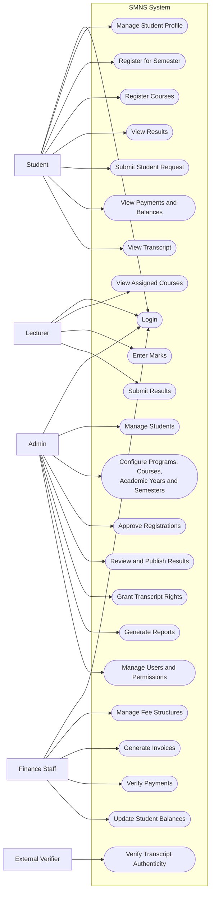
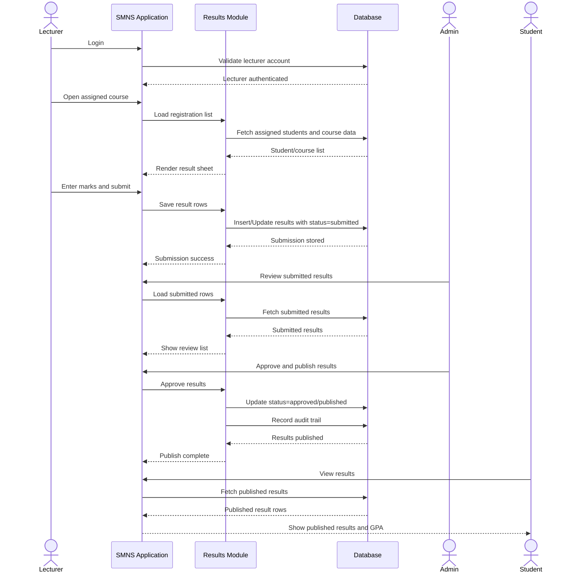
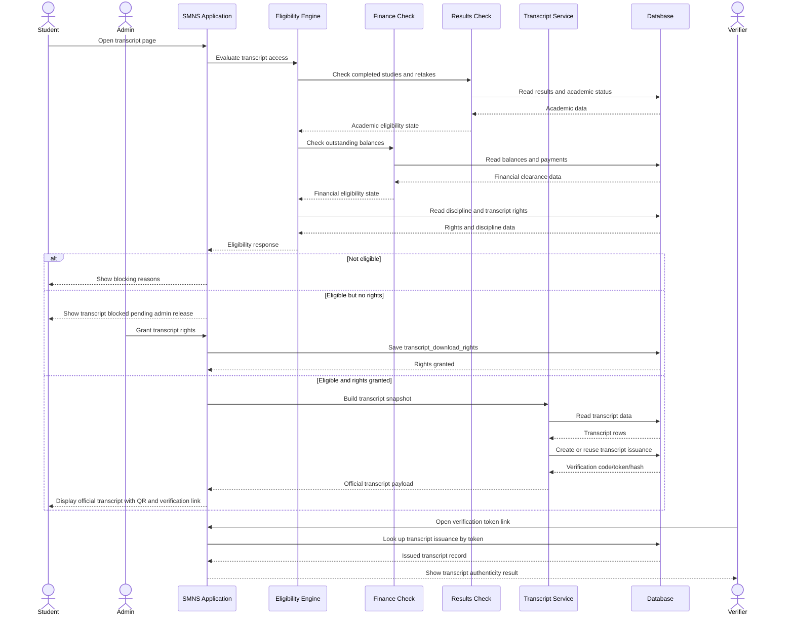
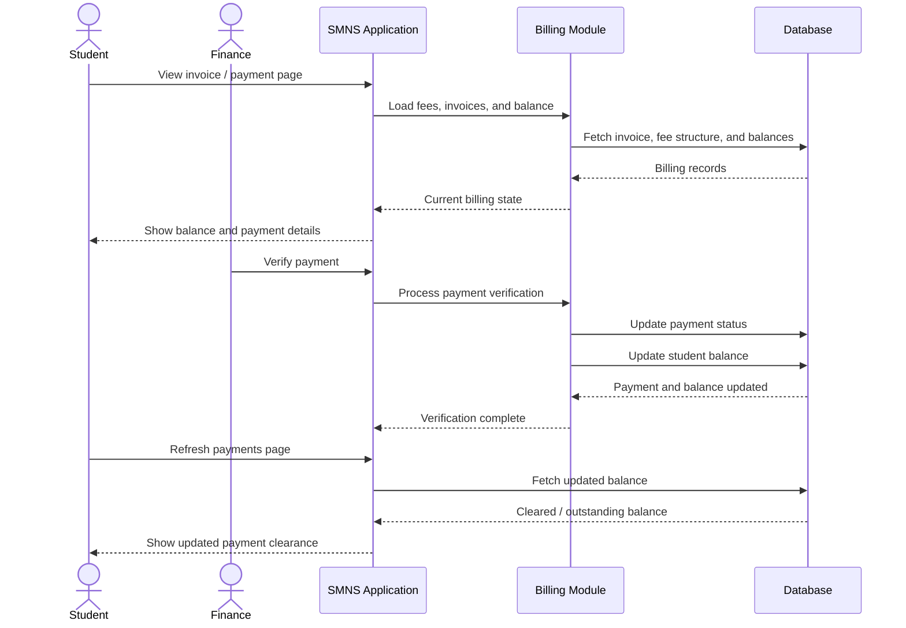

# SMNS UML System Design

This document provides UML-style system design diagrams for the Seminary Management and Results System (`SMNS`).

It includes:

- `Use Case Diagrams` for system actors and functions
- `Class Diagram` for the main data structures and relationships
- `Sequence Diagrams` for important system operations

## 1. Use Case Diagram

This use case view shows the main system actors and the major functions they interact with.

Note:
- Mermaid does not have a native UML use-case syntax like PlantUML.
- For report use, the diagram below is structured as a use-case diagram using actors and oval-like function nodes.

## 2. Class Diagram

This class diagram models the core SMNS data structures and their relationships at application level.

```mermaid
classDiagram
    class User {
        +int id
        +string username
        +string email
        +string role
        +string status
        +login()
        +logout()
    }

    class Student {
        +int id
        +int user_id
        +string student_id
        +string admission_number
        +string first_name
        +string last_name
        +string academic_status
        +string discipline_status
        +registerSemester()
        +registerCourses()
        +viewResults()
        +viewTranscript()
    }

    class Lecturer {
        +int id
        +int user_id
        +string first_name
        +string last_name
        +string department
        +viewAssignedCourses()
        +enterMarks()
        +submitResults()
    }

    class Admin {
        +int id
        +int user_id
        +string first_name
        +string last_name
        +approveRegistration()
        +publishResults()
        +grantTranscriptRights()
        +generateReports()
    }

    class FinanceStaff {
        +int id
        +int user_id
        +string first_name
        +string last_name
        +createInvoice()
        +verifyPayment()
        +updateBalance()
    }

    class Program {
        +int id
        +string program_code
        +string program_name
        +int duration_years
    }

    class AcademicYear {
        +int id
        +string year_name
        +string status
    }

    class Semester {
        +int id
        +int academic_year_id
        +string semester_name
        +int semester_number
        +string status
    }

    class Course {
        +int id
        +string course_code
        +string course_name
        +int program_id
        +int level_year
        +int semester_offered
    }

    class SemesterRegistration {
        +int id
        +int student_id
        +int semester_id
        +int year_of_study
        +string status
        +approve()
    }

    class CourseRegistration {
        +int id
        +int student_id
        +int course_id
        +int semester_id
        +string status
    }

    class Result {
        +int id
        +int student_id
        +int course_id
        +int semester_id
        +int entered_by
        +int approved_by
        +decimal total_marks
        +string grade
        +decimal grade_points
        +string status
        +submit()
        +approve()
        +publish()
    }

    class StudentGPA {
        +int id
        +int student_id
        +int semester_id
        +decimal semester_gpa
        +decimal cumulative_gpa
        +calculate()
    }

    class Invoice {
        +int id
        +int student_id
        +int semester_id
        +decimal total_amount
        +string status
    }

    class Payment {
        +int id
        +int student_id
        +int semester_id
        +decimal amount_paid
        +string payment_method
        +string payment_status
        +verify()
    }

    class StudentBalance {
        +int id
        +int student_id
        +int semester_id
        +decimal total_fees
        +decimal total_paid
        +decimal balance
        +updateBalance()
    }

    class TranscriptDownloadRight {
        +int id
        +int student_id
        +string status
        +grant()
        +revoke()
    }

    class TranscriptIssuance {
        +int id
        +int student_id
        +string transcript_hash
        +string verification_code
        +string verification_token
        +string status
        +issue()
        +verify()
    }

    class StudentRequest {
        +int id
        +int student_id
        +string request_type
        +string status
        +submit()
        +review()
    }

    User <|-- Student
    User <|-- Lecturer
    User <|-- Admin
    User <|-- FinanceStaff

    Program "1" --> "*" Student : enrolls
    Program "1" --> "*" Course : offers
    AcademicYear "1" --> "*" Semester : contains
    Student "1" --> "*" SemesterRegistration : submits
    Student "1" --> "*" CourseRegistration : makes
    Semester "1" --> "*" SemesterRegistration : groups
    Semester "1" --> "*" CourseRegistration : groups
    Course "1" --> "*" CourseRegistration : selected_in
    Lecturer "1" --> "*" Result : enters
    Admin "1" --> "*" Result : approves
    Student "1" --> "*" Result : receives
    Course "1" --> "*" Result : belongs_to
    Semester "1" --> "*" Result : published_in
    Student "1" --> "*" StudentGPA : accumulates
    Student "1" --> "*" Invoice : billed
    Student "1" --> "*" Payment : pays
    Student "1" --> "*" StudentBalance : has
    Student "1" --> "0..1" TranscriptDownloadRight : granted
    Student "1" --> "*" TranscriptIssuance : issued
    Student "1" --> "*" StudentRequest : raises
```

## 3. Sequence Diagram: Results Entry and Publishing

This sequence diagram shows how marks move from lecturer entry to student visibility.

## 4. Sequence Diagram: Transcript Eligibility and Release

This sequence diagram shows the key transcript-control workflow in the current SMNS implementation.

## 5. Sequence Diagram: Payment Verification and Balance Update

This sequence diagram shows how finance workflows affect student clearance.

## Recommended Use In Your Report

Use these diagrams in this order:

1. Use Case Diagram
2. Class Diagram
3. Sequence Diagram for Results
4. Sequence Diagram for Transcript
5. Sequence Diagram for Payments

That order moves from user perspective, to structure, to process behavior.
